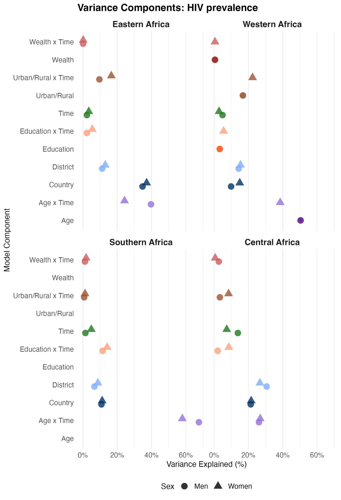

# Socio-demographic and geographic disparities in HIV prevalence, HIV testing and treatment coverage: An analysis of 108 national household surveys in 33 African countries

Replication code for Allorant et al. (*Journal of the International AIDS Society*, 2025).

## Summary

Accompanies *Socio-demographic and geographic disparities in HIV prevalence, HIV testing and treatment coverage: An analysis of 108 national household surveys in 33 African countries* (Allorant et al., J Int AIDS Soc, 2025). Multilevel Bayesian logistic regression models assess associations between HIV prevalence, recent HIV testing, and ART coverage and socio-demographic characteristics (age, education, residence, wealth), geography (country, district), and time. Separate models for men and women across four sub-regions of sub-Saharan Africa. Numbered scripts (`1_data_prep.R` → `5_APC_sensitivity_analyses.R`) run in order; `main_figures.R` produces the paper figures.



*Figure 2: Proportion of variance explained by each component of the best regression model for HIV prevalence; sex- and region-stratified. Reproduced by the corresponding block in `main_figures.R`.*

## File structure

Flat layout — all scripts live at the repository root.

| File | Contains |
| --- | --- |
| `1_data_prep.R` | Loads pre-processed geomatched survey datasets, harmonises survey IDs and country codes, writes per-indicator `.rdata` files for downstream scripts. |
| `2_model_selection.R` | Fits a family of multilevel Bayesian logistic regression models per indicator, region, and sex; computes information criteria; selects the best-fitting specification. |
| `3_sensitivity_analyses.R` | Refits the selected model after removing education and wealth covariates, for sensitivity checks. |
| `4_calculating_APC.R` | Calculates annual percentage change (APC) estimates from the fitted models. |
| `5_APC_sensitivity_analyses.R` | Recomputes APC estimates using the sensitivity-analysis model fits. |
| `main_figures.R` | Produces the figures in the published manuscript. |

## Data

108 nationally representative household surveys from 33 sub-Saharan African countries (Demographic and Health Surveys, AIDS Indicator Surveys, and Population-based HIV Impact Assessments). Survey microdata are restricted-use and not distributed with this repository.

- DHS, AIS, and similar surveys: request access at [https://dhsprogram.com](https://dhsprogram.com).
- PHIA surveys: request access at [https://phia-data.icap.columbia.edu](https://phia-data.icap.columbia.edu).

The scripts expect pre-processed, geomatched `.rds` files at paths defined inside `1_data_prep.R`. The geomatching step is upstream of this repository.

<!--
FLAG: I inferred DHS / AIS / PHIA from survey IDs visible in the
scripts (e.g. MWI2020PHIA, references to a BWA2021BAIS row that is
filtered out). Confirm this is the full list, or correct it.
-->

## Reproducibility

- **Software**: R ≥ 4.0.0.
- **Bayesian inference**: [INLA](https://www.r-inla.org/) (primary), with `brms` used in the APC calculation step.
- **Spatial**: `sf`, with shapefiles loaded from the working directory (see `2_model_selection.R`).
- **Survey data handling**: `haven` (for DHS Stata files), `data.table`, `tidyverse`.
- **Modelling utilities**: `arm`, `Matrix`.
- **Plotting**: `ggplot2`, `tile`, `RColorBrewer`, `PNWColors`, `ggtext`.

To reproduce: open the project in R, edit the directory paths at the top of `1_data_prep.R`, and run the numbered scripts in order, followed by `main_figures.R`.

## Citation

Allorant, A., Kuchukhidze, S., Stannah, J., Xia, Y., Masuku, S.S., Ekanmian, G.K., Imai-Eaton, J.W., Maheu-Giroux, M. (2025). Socio-demographic and geographic disparities in HIV prevalence, HIV testing and treatment coverage: An analysis of 108 national household surveys in 33 African countries. *Journal of the International AIDS Society*, 28, e70024. [https://doi.org/10.1002/jia2.70024](https://doi.org/10.1002/jia2.70024)

```bibtex
@article{allorant2025district,
  author = {Allorant, Adrien and Kuchukhidze, Salome and Stannah, James and
            Xia, Yiqing and Masuku, Sanele S. and Ekanmian, Gatien K. and
            Imai-Eaton, Jeffrey W. and Maheu-Giroux, Mathieu},
  title = {Socio-demographic and geographic disparities in {HIV} prevalence,
           {HIV} testing and treatment coverage: An analysis of 108 national
           household surveys in 33 {A}frican countries},
  journal = {Journal of the International AIDS Society},
  volume = {28},
  pages = {e70024},
  year = {2025},
  doi = {10.1002/jia2.70024}
}
```

## Contact

- Adrien Allorant — [adrien.allorant@soton.ac.uk](mailto:adrien.allorant@soton.ac.uk)
- [ORCID](https://orcid.org/0000-0002-9663-7561)

## Licence

GPL-3.0 — see [`LICENSE`](LICENSE).
